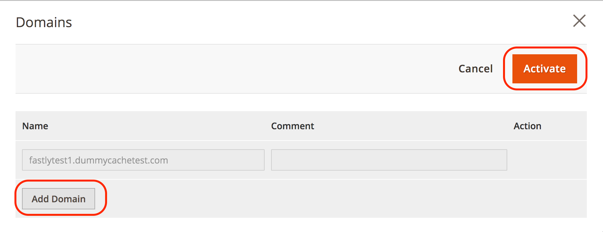

# Personalizza configurazione cache

Dopo aver configurato e testato il servizio Fastly negli ambienti di staging e produzione, rivedi e personalizza le impostazioni di configurazione della cache. Ad esempio, puoi aggiornare le impostazioni per forzare TLS a reindirizzare le richieste HTTP a Fastly, aggiornare le impostazioni di rimozione e abilitare l’autenticazione di base per proteggere il sito tramite password durante lo sviluppo.

Le sezioni seguenti forniscono una panoramica e istruzioni per la configurazione di alcune impostazioni della cache. Ulteriori informazioni sulle opzioni di configurazione disponibili in [Modulo CDN Fastly per il Magento 2](https://github.com/fastly/fastly-magento2/tree/master/Documentation) documentazione.

## Forza TLS

Fastly fornisce _Forza TLS_ opzione per reindirizzare le richieste non crittografate (HTTP) a Fastly. Dopo il provisioning dell’ambiente di staging o produzione con un [certificato SSL/TLS valido](fastly-configuration.md#provision-ssltls-certificates), è possibile aggiornare la configurazione Fastly per l’archivio per abilitare l’opzione Force TLS. Vedi la Fastly [Forza guida TLS](https://github.com/fastly/fastly-magento2/blob/master/Documentation/Guides/FORCE-TLS.md) nel _Modulo CDN Fastly per il Magento 2_ documentazione.

>[!NOTE]
>
>L’abilitazione dell’opzione Forza TLS è una best practice consigliata per Adobe Commerce sugli archivi dell’infrastruttura cloud.

## Estendi timeout rapido

La configurazione del servizio Fastly specifica un periodo di timeout predefinito di 180 secondi per le richieste HTTPS all’amministratore. Qualsiasi elaborazione di richiesta che supera il periodo di timeout restituisce un errore 503. Di conseguenza, puoi ricevere 503 errori in risposta a richieste che richiedono una lunga elaborazione o quando tenti di eseguire operazioni in blocco.

Per completare le azioni in blocco che richiedono più di 3 minuti, modificare la _Timeout percorso amministratore_ per evitare errori 503.

>[!NOTE]
>
>Per estendere i parametri di timeout Fastly per utenti diversi dall’amministratore nell’interfaccia utente Fastly, consulta [Aumentare i timeout per i processi lunghi](https://github.com/fastly/fastly-magento2/blob/master/Documentation/Guides/Edge-Modules/EDGE-MODULE-INCREASE-TIMEOUTS-LONG-JOBS.md).

**Per estendere il timeout Fastly per l’amministratore**:

{{admin-login-step}}

1. Clic **Negozi** > Impostazioni > **Configurazione** > **Avanzate** > **Sistema** ed espandi **Cache a pagina intera**.

1. In _Configurazione rapida_ , espandere **Configurazione avanzata**.

1. Imposta il **Timeout percorso amministratore** valore in secondi. Questo valore non può essere superiore a 10 minuti (600 secondi).

1. Clic **Salva configurazione** nella parte superiore della pagina.

1. Dopo il ricaricamento della pagina, seleziona **Carica VCL in Fastly** nel _Configurazione rapida_ sezione.

Recupera in modo rapido il percorso di amministrazione per la generazione del file VCL dalla `app/etc/env.php` file di configurazione.

## Configurare le opzioni di eliminazione

In Fastly fornisce diversi tipi di opzioni di eliminazione nella pagina Gestione cache di Magento, tra cui opzioni per rimuovere la categoria di prodotto, le risorse di prodotto e il contenuto. Quando questa opzione è attivata, Fastly controlla la presenza di eventi per eliminare automaticamente tali cache. Se disattivi un’opzione di eliminazione, puoi rimuovere manualmente le cache Fastly dopo aver completato gli aggiornamenti tramite la pagina Gestione cache.

Le opzioni di eliminazione includono:

- **Elimina categoria**- Elimina il contenuto della categoria di prodotto (non il contenuto del prodotto) quando si aggiunge e si aggiorna un singolo prodotto. Puoi mantenere disattivato e abilitare l’eliminazione del prodotto, che elimina i prodotti e le categorie di prodotti.
- **Svuota prodotto**- Elimina tutti i contenuti di prodotti e categorie di prodotti quando si salva una singola modifica a un prodotto. L’abilitazione dell’eliminazione del prodotto può essere utile per ottenere immediatamente aggiornamenti ai clienti quando si modifica un prezzo, si aggiunge un’opzione di prodotto e quando l’inventario del prodotto è esaurito.
- **Pagina Rimuovi CMS**- Elimina il contenuto della pagina durante l’aggiornamento e l’aggiunta di pagine al CMS di Adobe Commerce. Ad esempio, potrebbe essere utile eseguire la rimozione durante l&#39;aggiornamento dei Termini e Condizioni o delle Regole sulla restituzione. Se queste modifiche vengono apportate raramente, è possibile disattivare la rimozione automatica.
- **Pulizia temporanea**-Imposta il contenuto modificato su non aggiornato e lo svuota in base ai tempi non aggiornati. Oltre agli intervalli non aggiornati, ai clienti vengono distribuiti contenuti non aggiornati mentre Fastly aggiorna i contenuti in background.

**Per configurare le opzioni di eliminazione rapida**:

1. In _Configurazione rapida_ , espandere **Configurazione avanzata** per visualizzare le opzioni di rimozione.

1. Per ogni opzione di eliminazione, seleziona **Sì** per consentire lo svuotamento automatico, oppure **No** per disattivare la rimozione automatica.

   Quando disattivi un’opzione di eliminazione, devi eliminare manualmente la cache per tale categoria dal _Gestione cache_ pagina.

1. Clic **Salva configurazione** nella parte superiore della pagina.

1. Dopo il ricaricamento della pagina, seleziona **Carica VCL in Fastly** nel _Configurazione rapida_ sezione.

Per ulteriori informazioni, consulta [le opzioni di configurazione Fastly](https://github.com/fastly/fastly-magento2/blob/21b61c8189971275589219d418332798efc7db41/Documentation/CONFIGURATION.md#further-configuration-options).

## Configurare la gestione GeoIP

Il modulo Fastly include la gestione GeoIP per reindirizzare automaticamente i visitatori o fornire un elenco di store che corrispondono al codice del paese ottenuto. Se utilizzi già un’estensione per la gestione GeoIP, potrebbe essere necessario verificare le funzioni con le opzioni Fastly.

**Per impostare la gestione GeoIp**:

{{admin-login-step}}

1. Clic **Negozi** > Impostazioni > **Configurazione** > **Avanzate** > **Sistema** ed espandi **Cache a pagina intera**.

1. In _Configurazione rapida_ , espandere **Configurazione avanzata**.

1. Scorri verso il basso e seleziona **Sì** a **Abilita GeoIP**. Vengono visualizzate ulteriori opzioni di configurazione.

1. Per Azione GeoIP, seleziona se il visitatore viene automaticamente reindirizzato con **Reindirizza** o fornito un elenco di negozi tra cui scegliere con **Finestra di dialogo**.

1. Per **Mappatura paese**, seleziona **Aggiungi** per inserire un codice paese di due lettere da mappare da un elenco a uno specifico store di Adobe Commerce.

   

1. Clic **Salva configurazione** nella parte superiore della pagina.

1. Dopo il ricaricamento della pagina, seleziona **Carica VCL in Fastly** nel _Configurazione rapida_ sezione.

>[!NOTE]
>
>L’attuale implementazione del modulo Adobe Commerce Fastly GeoIP non supporta i reindirizzamenti tra più siti web.

Fastly fornisce anche una serie di [feature VCL correlate alla geolocalizzazione](https://developer.fastly.com/reference/vcl/variables/geolocation/) per la codifica di geolocalizzazione personalizzata.

## Abilita moduli Fastly Edge

Fastly Edge Modules è un framework flessibile che consente di definire i componenti dell’interfaccia utente e il codice VCL associato tramite un modello. Questi moduli semplificano la personalizzazione e l’estensione della configurazione del servizio Fastly tramite l’interfaccia utente, anziché utilizzare snippet VCL personalizzati.

I moduli Edge ti consentono di abilitare funzionalità specifiche come intestazioni CORS, riscritture di Cloud Sitemap e di configurare l’integrazione tra lo store di Adobe Commerce e altri CMS o back-end.

Per accedere al menu Moduli Edge e visualizzare, configurare e gestire i moduli disponibili, attivare _Abilita moduli Fastly Edge_ opzione. Consulta [Moduli Fastly Edge](https://github.com/fastly/fastly-magento2/blob/master/Documentation/Guides/Edge-Modules/EDGE-MODULES.md) nella documentazione del modulo CDN Fastly.

## Configurare back-end e schermatura origine

Le impostazioni back-end consentono di ottimizzare le prestazioni in modo rapido con schermatura origine e timeout. A _back-end_ è una posizione specifica (IP o dominio) con configurato lo scudo di origine e le impostazioni di timeout per la verifica e la fornitura di contenuto memorizzato nella cache.

_Schermatura origine_ indirizza tutte le richieste per il tuo archivio a un punto di presenza specifico (POP). Quando viene ricevuta una richiesta, il POP controlla il contenuto memorizzato nella cache e lo fornisce. Se non viene memorizzato in cache, continua fino a Shield POP (POP schermato) e poi al server di origine che memorizza in cache il contenuto. Gli scudi riducono il traffico direttamente all&#39;origine.

Il codice VCL Fastly predefinito specifica i valori predefiniti per la schermatura di origine e i timeout per l’Adobe Commerce sui siti dell’infrastruttura cloud. In alcuni casi, potrebbe essere necessario modificare i valori predefiniti. Ad esempio, se si verificano errori TTFB (Time to First Byte), potrebbe essere necessario regolare _timeout primo byte_ valore.

>[!NOTE]
>
>Se il tuo sito richiede un’implementazione funzionale tramite un’integrazione back-end come [Wordpress](fastly-vcl-wordpress.md), personalizza la configurazione del servizio Fastly per aggiungere il back-end e gestire i reindirizzamenti dal tuo archivio Adobe Commerce a Wordpress. Per ulteriori informazioni, consulta [Moduli Fastly Edge - Altra integrazione CMS/Backend](https://github.com/fastly/fastly-magento2/blob/master/Documentation/Guides/Edge-Modules/EDGE-MODULE-OTHER-CMS-INTEGRATION.md) nella documentazione del modulo Fastly.

**Per rivedere la configurazione delle impostazioni di back-end**:

{{admin-login-step}}

1. Clic **Negozi** > Impostazioni > **Configurazione** > **Avanzate** > **Sistema** ed espandi **Cache a pagina intera**.

1. Espandi **Configurazione rapida** sezione.

1. Espandi **Impostazioni back-end** e selezionare l&#39;ingranaggio per controllare il back-end di default. Viene visualizzata una finestra modale che mostra le impostazioni correnti con le opzioni per modificarle.

   

1. Seleziona la **Scudo** posizione (o centro dati).

   La configurazione Fastly predefinita per il progetto imposta la posizione più vicina all’area del servizio Cloud. Se è necessario modificarlo, selezionare una posizione vicina a quella predefinita.

1. Modificare i valori di timeout (in microsecondi) per la connessione allo scudo, il tempo tra i byte e il tempo per il primo byte. È consigliabile mantenere le impostazioni di timeout predefinite.

1. Facoltativamente, seleziona per **Attiva il backend e lo scudo dopo la modifica o il salvataggio**.

1. Clic **Carica** per salvare le modifiche e caricarle sui server Fastly.

1. In Amministratore, seleziona **Salva configurazione**.

Per ulteriori informazioni, vedere [Guida alle impostazioni di back-end](https://github.com/fastly/fastly-magento2/blob/21b61c8189971275589219d418332798efc7db41/Documentation/Guides/BACKEND-SETTINGS.md) nella documentazione del modulo Fastly.

## Autenticazione di base

L’autenticazione di base è una funzione che protegge con un nome utente e una password ogni pagina e risorsa del sito. Noi **non consigliare** attivazione dell’autenticazione di base nell’ambiente di produzione. Puoi configurarlo in Staging per proteggere il sito durante il processo di sviluppo. Consulta la [Guida all’autenticazione di base](https://github.com/fastly/fastly-magento2/blob/master/Documentation/Guides/BASIC-AUTH.md) nella documentazione del modulo CDN Fastly.

Se aggiungi l’accesso utente e abiliti l’autenticazione di base nella gestione temporanea, puoi comunque accedere all’amministratore senza richiedere credenziali aggiuntive.

## Creare snippet VCL personalizzati

Fastly supporta una versione personalizzata del linguaggio di configurazione della vernice (VCL) per personalizzare la configurazione del servizio Fastly. Ad esempio, puoi consentire, bloccare o reindirizzare l’accesso a utenti o indirizzi IP specifici utilizzando blocchi di codice VCL con dizionari Edge e Access Control List (ACL).

Per istruzioni su come creare snippet VCL personalizzati, dizionari edge e ACL, vedere [Snippet VCL Fastly personalizzati](fastly-vcl-custom-snippets.md).

>[!NOTE]
>
>Prima di aggiungere codice VCL personalizzato, dizionari perimetrali e ACL alla configurazione del modulo Fastly, verificare che il servizio di caching Fastly funzioni con la configurazione predefinita. Consulta [Configura Fastly](fastly-configuration.md).

## Gestione domini

Sia per i progetti Starter che per quelli Pro, potete utilizzare [!UICONTROL Domains] per aggiungere e gestire la configurazione del dominio Fastly per lo store.

- Per i progetti iniziali, vai all’URL del progetto nella sezione [!UICONTROL Domains] scheda in [!DNL Cloud Console] per aggiungere l’URL del progetto.

- Per i progetti Pro, invia un [Ticket di supporto Adobe Commerce](https://experienceleague.adobe.com/docs/commerce-knowledge-base/kb/help-center-guide/magento-help-center-user-guide.html#submit-ticket) per aggiungere il dominio alla configurazione del progetto cloud. Il team di supporto aggiorna anche la configurazione dell’account Adobe Commerce Fastly per aggiungere il dominio.

**Per gestire la configurazione del dominio Fastly dall’amministratore**:

{{admin-login-step}}

1. Seleziona **Negozi** > Impostazioni > **Configurazione** > **Avanzate** > **Sistema** ed espandi **Cache a pagina intera**.

1. In Admin _Configurazione rapida_ sezione, seleziona **Domini**.

1. Clic **Gestisci domini** per aprire la pagina Domini.

1. Aggiungi i nomi di primo livello e sottodominio per gli archivi nell’ambiente Cloud.

   Puoi specificare solo i domini che sono già stati aggiunti alla configurazione dell’infrastruttura cloud.

   

1. Clic **Attiva** per aggiornare la configurazione del dominio Fastly.

>[!NOTE]
>
>Se lo stesso dominio è stato configurato su un account Fastly diverso, è necessario inviare un ticket di supporto Adobe Commerce per richiedere la delega del dominio prima di poter aggiungere il dominio ad Adobe Commerce. Consulta [Più account Fastly e domini assegnati](fastly.md#multiple-fastly-accounts-and-assigned-domains).

## Abilita modalità manutenzione

Utilizza il _Modalità manutenzione_ opzione per consentire l&#39;accesso amministrativo al sito da indirizzi IP specificati e restituire una pagina di errore per tutte le altre richieste.

**Per attivare la modalità di manutenzione con accesso amministrativo**:

1. Apri _Configurazione rapida_ in Admin.

1. In _ACL Edge_ , aggiorna la sezione `maint_allow` l&#39;elenco di controllo di accesso (ACL) con gli indirizzi IP amministrativi che possono accedere all&#39;archivio mentre è in modalità di manutenzione.

   

1. In _Modalità manutenzione_ sezione, seleziona **Abilita modalità manutenzione**.

   Dopo aver attivato la modalità di manutenzione, tutto il traffico viene bloccato, ad eccezione delle richieste provenienti dagli indirizzi IP presenti in `maint_allowlist` ACL È possibile aggiornare `maint_allowlist` per modificare gli indirizzi IP nell’ACL.

   Per istruzioni di configurazione dettagliate, vedi [Guida alla modalità di manutenzione](https://github.com/fastly/fastly-magento2/blob/master/Documentation/Guides/MAINTENANCE-MODE.md) nella Fastly CDN per la documentazione del modulo Magento 2.
