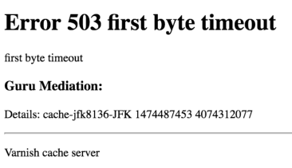

# Risoluzione rapida dei problemi

Utilizza le seguenti informazioni per risolvere i problemi e gestire il modulo Fastly CDN per il Magento 2 nell’ambiente di progetto Adobe Commerce on Cloud Infrastructure. Ad esempio, puoi analizzare i valori delle intestazioni di risposta e il comportamento di caching per risolvere i problemi di servizio e prestazioni Fastly.

Negli ambienti di produzione e staging di Pro, è possibile utilizzare [Registri di New Relic](../monitor/log-management.md) per visualizzare e analizzare i dati di registro Fastly CDN e WAF per risolvere gli errori e i problemi di prestazioni.

>[!NOTE]
>
>Per informazioni sulla configurazione di Fastly, vedere [Configura Fastly](fastly.md).

## Individua ID servizio Fastly

È necessario l’ID servizio Fastly per configurare Fastly dall’amministratore o per inviare richieste API Fastly per la configurazione e la risoluzione dei problemi Fastly avanzati.

Se Fastly è abilitato nell’ambiente del progetto, puoi ottenere l’ID servizio dall’Amministratore. Consulta [Ottieni credenziali rapide](fastly-configuration.md#get-fastly-credentials).

Gli sviluppatori e gli utenti VCL avanzati possono utilizzare VCL personalizzato per recuperare l’ID del servizio utilizzando la variabile Fastly `req.service_id`. Ad esempio, puoi aggiungere `req.service_id` alla direttiva di registrazione personalizzata nel file VCL per acquisire il valore dell’ID servizio:

```json
log {"syslog"} req.service_id {" my_logging_endpoint_name :: "}
```

È possibile utilizzare lo stesso VCL per gli ambienti di produzione e staging. Consulta [Come configurare vcl_log](https://support.fastly.com/hc/en-us/community/posts/360040447172-How-to-configure-vcl-log).

## Problemi relativi a prestazioni del sito, eliminazione e cache

Utilizza il seguente elenco per identificare e risolvere i problemi relativi alla configurazione del servizio Fastly per l’ambiente Adobe Commerce sull’infrastruttura cloud.

- **Il menu del Negozio non viene visualizzato o non funziona**: potresti utilizzare un collegamento o un collegamento temporaneo direttamente al server di origine invece di utilizzare l’URL del sito live, oppure hai utilizzato `-H "host:URL"` in un [comando cURL](#check-live-site-through-fastly). Se salti Fastly al server di origine, il menu principale non funziona e vengono visualizzate intestazioni non corrette che consentono il caching sul lato browser.

- **La navigazione superiore non funziona**- La navigazione superiore si basa sull&#39;elaborazione ESI (Edge Side Includes) abilitata quando si carica il Magento predefinito Fastly Snippet VCL. Se la navigazione non funziona, [carica Fastly VCL](fastly-configuration.md#upload-vcl-to-fastly) e ricontrolla il sito.

- **La geolocalizzazione/GeoIP non funziona**— Il Magento predefinito Fastly VCL snippet aggiunge il codice del paese all&#39;URL. Se il codice del paese non funziona, [carica Fastly VCL](fastly-configuration.md#upload-vcl-to-fastly) e ricontrolla il sito.

- **Le pagine non vengono memorizzate in cache**- Per impostazione predefinita, Fastly non memorizza in cache le pagine con `Set-Cookies` intestazione. Adobe Commerce imposta i cookie anche su pagine memorizzabili in cache (TTL > 0). Il Magento predefinito Fastly VCL elimina tali cookie dalle pagine memorizzabili in cache. Se le pagine non vengono memorizzate in cache, [carica Fastly VCL](fastly-configuration.md#upload-vcl-to-fastly) e ricontrolla il sito.

  Questo problema può verificarsi anche se un blocco di pagina in un modello è contrassegnato come non memorizzabile in cache. In tal caso, il problema è probabilmente causato da un modulo o da un’estensione di terze parti che blocca o rimuove le intestazioni di Adobe Commerce. Per risolvere il problema, vedi [X-Cache contiene solo mancanti, nessun HIT](#x-cache-contains-only-miss-no-hit).

- **Le richieste di eliminazione non riescono**- Fastly restituisce il seguente errore quando si invia una richiesta di rimozione:

  ```text
  The purge request was not processed successfully.
  ```

  Questo problema può essere causato da uno dei seguenti problemi:

   - Credenziali Fastly non valide nella configurazione del servizio Fastly per l’ambiente di progetto Adobe Commerce su infrastruttura cloud
   - Codice non valido in uno snippet VCL personalizzato

  Per risolvere il problema, vedi [Errore durante la rimozione della cache Fastly nel cloud](https://support.magento.com/hc/en-us/articles/115001853194-Error-purging-Fastly-cache-on-Cloud-The-purge-request-was-not-processed-successfully-) nel Centro assistenza Adobe Commerce.

## 503 errori di Fastly

Se Fastly restituisce errori di timeout 503, controllare i registri di errore e la pagina di errore 503 per identificare la causa principale.

>[!NOTE]
>
>Se il timeout si verifica durante l’esecuzione di operazioni in blocco, puoi [estendere il timeout Fastly per l’amministratore](fastly-custom-cache-configuration.md#extend-fastly-timeout).

Se ricevi un errore 503, controlla il registro degli errori dell’ambiente di produzione o di staging e il registro di accesso php per risolvere il problema.

**Per controllare i registri degli errori**:

- [Registro errori](../test/log-locations.md#application-logs)

  ```text
  /var/log/platform/<project-ID>/error.log
  ```

  Questo registro include tutti gli errori dell&#39;applicazione o del motore PHP, ad esempio `memory_limit` o `max_execution_time exceeded` errori. Se non trovate alcun errore correlato Fastly, controllate il registro degli accessi PHP.

- Registro degli accessi PHP

  ```text
  /var/log/platform/<project-ID>/php.access.log
  ```

  Cerca nel registro le risposte HTTP 200 per l’URL che ha restituito l’errore 503. Se trovi la risposta 200, significa che Adobe Commerce ha restituito la pagina senza errori. Questo indica che il problema potrebbe essersi verificato dopo l’intervallo che supera il `first_byte_timeout` valore impostato nella configurazione del servizio Fastly.

Quando si verifica un errore 503, Fastly restituisce il motivo nella pagina di errore e manutenzione. Potresti non essere in grado di vedere il motivo se hai aggiunto il codice per un [pagina di risposta personalizzata](fastly-custom-response.md). Per visualizzare il codice motivo nella pagina di errore predefinita, è possibile rimuovere il codice HTML per la pagina di errore personalizzata.

**Per controllare la pagina di errore Fastly 503**:

{{admin-login-step}}

1. Clic **Negozi** > **Impostazioni** > **Configurazione** > **Avanzate** > **Sistema**.

1. Nel riquadro di destra, espandere **Cache a pagina intera**.

1. In **Configurazione rapida** , espandere **Pagine sintetiche personalizzate** come illustrato nella figura seguente.

   

1. Clic **Imposta HTML**.

1. Rimuovi il codice personalizzato. È possibile salvarlo in un programma di testo per aggiungerlo nuovamente in un secondo momento.

1. Clic **Carica** per inviare i tuoi aggiornamenti a Fastly.

1. Clic **Salva configurazione** nella parte superiore della pagina.

1. Riapri l’URL che ha causato l’errore 503. In Fastly restituisce una pagina di errore con il motivo, come illustrato nell&#39;esempio seguente.

   

## Apex e sottodomini già associati a un account Fastly

Se il dominio e i sottodomini APEX per il progetto di infrastruttura cloud Adobe Commerce on sono già associati a un account Fastly esistente con un ID servizio assegnato, non puoi avviarli finché non aggiorni la configurazione Fastly:

- Aggiorna la configurazione di apex e sottodominio sull’account Fastly esistente. Consulta [Più account Fastly e domini assegnati](fastly.md#domain).

- [Abilitare e configurare Fastly](fastly-configuration.md#enable-fastly-caching) e completare [Configurazione DNS](../launch/checklist.md#update-dns-configuration-with-production-settings)

## Verificare o eseguire il debug dei servizi Fastly

Puoi risolvere i problemi di prestazioni o caching per un sito Adobe Commerce sull’infrastruttura cloud testando gli URL del sito ed esaminando i valori di intestazione restituiti nella risposta.

### Controlla il sito live tramite Fastly

Utilizza l’API Fastly per controllare il  `Fastly-Magento-VCL-Uploaded` e `X-Cache` intestazioni di risposta restituite dal sito live.

Le richieste API Fastly vengono trasmesse tramite l’estensione Fastly per ottenere una risposta dai server di origine. Se la risposta restituisce intestazioni errate, verifica che [server di origine direttamente](#bypass-fastly-cache-to-check-adobe-commerce-sites).

**Controllare le intestazioni di risposta**:

1. In un terminale, utilizzare quanto segue `curl` comando per verificare l’URL del sito live:

   ```bash
   curl https://<live URL> -vo /dev/null -H Fastly-Debug:1
   ```

   Se non hai impostato una route statica o completato la configurazione DNS per i domini sul sito live, utilizza `--resolve` che ignora la risoluzione dei nomi DNS.

   ```bash
   curl -svo /dev/null --resolve '<your_hostname>:443:<IP-address-of-cache-node>' <https-URL>
   ```

   >[!NOTE]
   >
   >Per utilizzare questo comando con `--resolve` opzione, devi avere TLS abilitato con Fastly tramite un certificato SSL/TLS e trovare l’indirizzo IP del nodo della cache.

1. Nella risposta, verifica i [intestazioni](#check-cache-hit-and-miss-response-headers) per garantire che Fastly funzioni. Dovresti visualizzare le seguenti intestazioni univoche nella risposta:

   ```http
   < Fastly-Magento-VCL-Uploaded: yes
   < X-Cache: HIT, MISS
   ```

Se i valori delle intestazioni non sono corretti, consulta le seguenti informazioni:

- [Verifica caricamento VCL](#fastly-vcl-has-not-been-uploaded)

- [X-Cache contiene solo mancanti, nessun HIT](#x-cache-contains-only-miss-no-hit)

### Ignora Fastly Cache per controllare i siti Adobe Commerce

Se il servizio Fastly restituisce intestazioni non corrette, puoi creare uno snippet VCL che consente di inviare richieste ignorando la cache Fastly. Consulta [Ignora Fastly Cache](fastly-vcl-bypass-to-origin.md).

Dopo aver aggiunto lo snippet VCL, utilizzare i comandi cURL per inviare le richieste al server di origine dall&#39;indirizzo IP specificato. Quindi, controlla le risposte per individuare eventuali errori.

### Controllare le intestazioni di risposta cache HIT e MISS

Verifica che la risposta restituita contenga le seguenti informazioni:

- Include `X-Magento-Tags` intestazione

- Il valore della proprietà `Fastly-Module-Enabled` l’intestazione è `Yes` o il numero di versione del modulo Fastly per CDN Magento 2 installato nell’ambiente del progetto

- [Cache-Control: max-age](https://www.w3.org/Protocols/rfc2616/rfc2616-sec14.html#sec14.9) è maggiore di 0

- [Pragma](https://www.w3.org/Protocols/rfc2616/rfc2616-sec14.html#sec14.32) impostazione è `cache`

Nell&#39;estratto seguente dell&#39;output del comando cURL vengono visualizzati i valori corretti per `Pragma`, `X-Magento-Tags`, e `Fastly-Module-Enabled` intestazioni:

```terminal
* STATE: INIT => CONNECT handle 0x600057800; line 1402 (connection #-5000)
* Rebuilt URL to: https://www.mymagento.biz.c.sv7gVom4qrpek.ent.magento.cloud/
* Added connection 0. The cache now contains 1 members
* Trying 192.0.2.31...
* STATE: CONNECT => WAITCONNECT handle 0x600057800; line 1455 (connection #0)

% Total    % Received % Xferd  Average Speed   Time    Time     Time  Current
                                 Dload  Upload   Total   Spent    Left  Speed
0     0    0     0    0     0      0      0 --:--:-- --:--:-- --:--:--     0* Connected to www.mymagento.biz.c.sv7gVom4qrpek.ent.magento.cloud (54.229.163.31) port 443 (#0)

* STATE: WAITCONNECT => SENDPROTOCONNECT handle 0x600057800; line 1562 (connection #0)
  0     0    0     0    0     0      0      0 --:--:-- --:--:-- --:--:--     0* ALPN, offering h2

... portion omitted for brevity ...

< Set-Cookie: mage-messages=%5B%5D; expires=Wed, 22-Nov-2017 17:39:58 GMT; Max-Age=31536000; path=/
< Pragma: cache
< Expires: Wed, 23 Nov 2016 17:39:56 GMT
< Cache-Control: max-age=86400, public, s-maxage=86400, stale-if-error=5, stale-while-revalidate=5
< X-Magento-Tags: cb_welcome_popup store cb cb_store_info_mobile cb_header_promotional_bar cb_store_info cb_discount-promo-bar cpg_2 cb_83 cb_81 cb_84 cb_85 cb_86 cb_87 cb_88 cb_89 p5646 catalog_product p5915 p6040 p6197 p6227 p7095 p6109 p6122 p6331 p7592 p7651 p7690
< Fastly-Module-Enabled: yes
< Strict-Transport-Security: max-age=31536000
    < Content-Security-Policy: upgrade-insecure-requests
    < X-Content-Type-Options: nosniff
    < X-XSS-Protection: 1; mode=block
    < X-Frame-Options: SAMEORIGIN
    < X-Platform-Server: i-dff64b52
    <
    * STATE: PERFORM => DONE handle 0x600057800; line 1955 (connection #0)
    * multi_done
      0     0    0     0    0     0      0      0 --:--:--  0:00:02 --:--:--     0
    * Connection #0 to host www.mymagento.biz.c.sv7gVom4qrpek.ent.magento.cloud left intact
```

>[!NOTE]
>
>Per informazioni dettagliate sugli hit e sugli errori, consulta [Informazioni sulle intestazioni cache HIT e MISS con i servizi schermati](https://docs.fastly.com/guides/performance-tuning/understanding-cache-hit-and-miss-headers-with-shielded-services) nella documentazione di Fastly.

### Risolvi gli errori rilevati nelle intestazioni di risposta

Questa sezione fornisce suggerimenti per la risoluzione degli errori restituiti durante il controllo delle intestazioni di risposta tramite l’API Fastly.

#### Il modulo Fastly non è abilitato

Se il modulo Fastly non è abilitato (`Fastly-Module-Enabled: no`) o se manca l’intestazione, [utilizzare SSH per accedere](../development/secure-connections.md#connect-to-a-remote-environment) al progetto. Quindi, esegui il seguente comando per controllare lo stato del modulo.

```bash
php bin/magento module:status Fastly_Cdn
```

In base allo stato restituito, utilizza le istruzioni seguenti per aggiornare la configurazione Fastly.

- `Module does not exist`- Se il modulo non esiste [installare e configurare](https://github.com/fastly/fastly-magento2/blob/master/Documentation/INSTALLATION.md) il modulo CDN Fastly per il Magento 2 in un ramo di integrazione. Al termine dell’installazione, abilita e configura il modulo. Consulta [Configura Fastly](fastly-configuration.md).

- `Module is disabled`- Se il modulo Fastly è disabilitato, aggiornare la configurazione dell&#39;ambiente su un `integration` nell&#39;ambiente locale per abilitarlo. Quindi, invia le modifiche a Staging e Produzione. Consulta [Gestione estensioni](../store/extensions.md#install-an-extension).

  Se usa [Gestione configurazione](../store/store-settings.md#configure-store), controlla lo stato del modulo CDN Fastly in `app/etc/config.php` file di configurazione prima di inviare le modifiche all’ambiente di produzione o di staging.

  Se il modulo non è abilitato (`Fastly_CDN => 0`) in `config.php` file, elimina il file ed esegui il seguente comando per aggiornare `config.php` con le impostazioni di configurazione più recenti.

  ```bash
  bin/magento magento-cloud:scd-dump
  ```

#### VCL Fastly non è stato caricato

Se Fastly VCL non è stato caricato (`Fastly-Magento-VCL-Uploaded`: `false`), utilizza *Carica VCL* nell&#39;amministratore per caricarlo. Consulta [Carica snippet VCL Fastly](fastly-configuration.md#upload-vcl-to-fastly).

#### X-Cache contiene solo mancanti, nessun HIT

Se il `X-Cache` l’intestazione contiene `HIT` (`HIT, HIT` o `HIT, MISS`), indica che Fastly restituisce correttamente il contenuto memorizzato in cache.

Se il `X-Cache` l’intestazione è `MISS, MISS` e non contiene `HIT`, esegui `curl` per accertarsi che la pagina non sia stata eliminata di recente dalla cache.

Se ottieni lo stesso risultato, utilizza [`curl` comandi](#check-live-site-through-fastly) e verificare [intestazioni di risposta](#check-cache-hit-and-miss-response-headers):

- `Pragma` è `cache`
- `X-Magento-Tags` esiste
- `Cache-Control: max-age` è maggiore di 0

Se il problema persiste, è probabile che un’altra estensione ripristini queste intestazioni. Ripeti la procedura seguente nell’ambiente di staging disabilitando tutte le estensioni e riabilitando ciascuna per determinare quale estensione sta reimpostando le intestazioni. Dopo aver identificato l’estensione che causa il problema, devi disabilitarla nell’ambiente di produzione.

**Per identificare un’estensione che ripristina le intestazioni di risposta:**

{{admin-login-step}}

1. Accedi a **Negozi** > **Impostazioni** > **Configurazione** > **Avanzate** > **Avanzate**.

1. In *Disattiva output moduli* nel riquadro a destra, trova tutte le estensioni e disabilitale.

1. Clic **Salva configurazione**.

1. Clic **Sistema** > **Strumenti** > **Gestione cache**.

1. Clic **Svuota cache Magento**.

1. Completa i seguenti passaggi per ogni estensione che può causare problemi con le intestazioni Fastly:

   - Abilita un’estensione alla volta, salva la configurazione e svuota la cache di Adobe Commerce.

   - Esegui il [`curl` comandi](#check-live-site-through-fastly) per verificare [intestazioni di risposta](#check-cache-hit-and-miss-response-headers).

   Ripeti questa procedura per ogni estensione. Se le intestazioni di risposta Fastly non vengono più visualizzate, hai identificato l’estensione che sta causando problemi con Fastly.

Dopo aver identificato l’estensione che sta reimpostando le intestazioni Fastly, contatta lo sviluppatore di estensioni per ulteriore assistenza. Non è possibile fornire correzioni o aggiornamenti per far funzionare le estensioni di terze parti con il caching Fastly.

## Rollback della configurazione Fastly

Se gli aggiornamenti personalizzati del frammento di codice VCL o altre modifiche alla configurazione Fastly causano l’interruzione o la restituzione di errori da parte di un sito di infrastruttura cloud di Adobe Commerce, utilizza l’API Fastly [attivare](https://docs.fastly.com/api/config#version_0b79ae1ba6aee61d64cc4d43fed1e0d5) per tornare a una versione VCL precedente. Non è possibile eseguire il rollback della versione VCL dall&#39;amministratore.

**Per eseguire il rollback della versione VCL**:

1. Per ottenere un elenco delle versioni VCL disponibili per un servizio, eseguire il comando seguente

   ```bash
   curl -H "Fastly-Key: <FASTLY_API_TOKEN>" -H "Accept: application/json" https://api.fastly.com/service/<FASTLY_SERVICE_ID>/version
   ```

1. Eseguire il comando seguente per modificare la versione VCL attiva in una versione specificata.

   ```bash
   curl -H "Fastly-Key: <FASTLY_API_TOKEN>" -H "Content-Type: application/x-www-form-urlencoded" -H "Accept: application/json" -X PUT https://api.fastly.com/service/<FASTLY_SERVICE_ID>/version/<VERSION_ID>/activate
   ```

Per informazioni dettagliate sull’utilizzo dell’API Fastly per rivedere e gestire VCL, consulta [Gestire VCL tramite l’API](fastly-vcl-custom-snippets.md#manage-custom-vcl-snippets-using-the-api).
