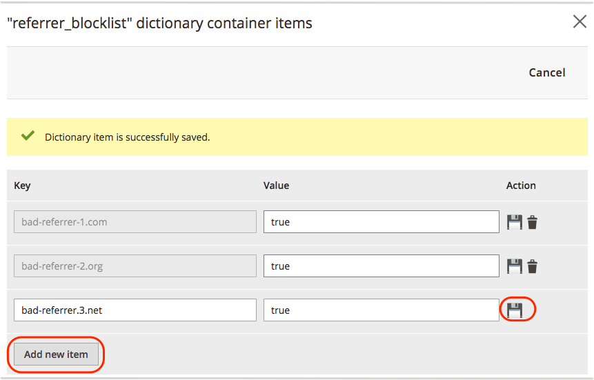

# Blocca spam di riferimento

L’esempio seguente mostra come configurare [Dizionario Fastly Edge](https://docs.fastly.com/guides/edge-dictionaries/working-with-dictionaries-using-the-api) con uno snippet VCL personalizzato per bloccare lo spam di riferimento dal sito Adobe Commerce sull’infrastruttura cloud.

>[!NOTE]
>
>È consigliabile aggiungere configurazioni VCL personalizzate a un ambiente di staging in cui è possibile testarle prima di eseguirle nell’ambiente di produzione.

**Prerequisiti:**

{{$include /help/_includes/vcl-snippet-prerequisites.md}}

- Controlla i registri del sito per individuare falsi URL di riferimento e crea un elenco di domini da bloccare.

## Creazione di un elenco Bloccati di referrer

I dizionari Edge creano coppie chiave-valore accessibili alle funzioni VCL durante l&#39;elaborazione dello snippet VCL. In questo esempio, crei un dizionario perimetrale che fornisce l’elenco dei siti web di provenienza da bloccare.

{{admin-login-step}}

1. Clic **Negozi** > **Impostazioni** > **Configurazione** > **Avanzate** > **Sistema**.

1. Espandi **Cache a pagina intera** > **Configurazione rapida** > **Dizionari Edge**.

1. Crea il contenitore Dizionario:

   - Clic **Aggiungi contenitore**.

   - Il giorno *Contenitore* , immettere un valore **Nome dizionario**—`referrer_blocklist`.

   - Seleziona **Attiva dopo la modifica** per distribuire le modifiche alla versione della configurazione del servizio Fastly che si sta modificando.

   - Clic **Carica** per collegare il dizionario alla configurazione del servizio Fastly.

1. Aggiungi l’elenco dei nomi di dominio da bloccare a `referrer_blocklist` dizionario:

   - Fai clic sull’icona Impostazioni per `referrer_blocklist` dizionario.

   - Aggiungi e salva coppie chiave-valore nel nuovo dizionario. Per questo esempio, ogni **Chiave** è il nome di dominio di un URL referente da bloccare e **Valore** è `true`.

     

   - Clic **Annulla** per tornare alla pagina di configurazione del sistema.

1. Clic **Salva configurazione**.

1. Aggiorna la cache in base alla notifica nella parte superiore della pagina.

Per ulteriori informazioni sui dizionari Edge, vedere [Creazione e utilizzo di dizionari di spigoli](https://docs.fastly.com/guides/edge-dictionaries/working-with-dictionaries-using-the-api) e [snippet VCL personalizzati](https://docs.fastly.com/guides/edge-dictionaries/working-with-dictionaries-using-the-api#custom-vcl-examples) nella documentazione di Fastly.

## Creare un frammento VCL personalizzato per bloccare lo spam del referente

Il seguente codice snippet VCL personalizzato (formato JSON) mostra la logica per controllare e bloccare le richieste. Lo snippet VCL acquisisce l’host di un sito web di riferimento in un’intestazione, quindi confronta il nome host con l’elenco di URL presenti nel `referrer_blocklist` dizionario. Se il nome host corrisponde, la richiesta viene bloccata con un `403 Forbidden` errore.

```json
{
  "name": "block_bad_referrer",
  "dynamic": "0",
  "type": "recv",
  "priority": "5",
  "content": "set req.http.Referer-Host = regsub(req.http.Referer, \"^https?:\/\/?([^:\/s]+).*$\", \"\\1\"); if (table.lookup(referrer_blocklist, req.http.Referer-Host)) { error 403 \"Forbidden\"; }"
}
```

Prima di creare uno snippet basato su questo esempio, esaminare i valori per determinare se è necessario apportare modifiche:

- `name` — Nome dello snippet VCL. Per questo esempio, abbiamo utilizzato `block_bad_referrer`.

- `dynamic` — Il valore 0 indica un [frammento normale](https://docs.fastly.com/en/guides/using-regular-vcl-snippets) per caricare nel file VCL con versione per la configurazione Fastly.

- `priority` — Determina quando viene eseguito lo snippet VCL. La priorità è `5` per eseguire questo codice snippet prima di uno qualsiasi dei snippet VCL di Magento predefiniti (`magentomodule_*`) ha assegnato una priorità di 50. Impostare la priorità per ogni frammento personalizzato su un valore maggiore o minore di 50 a seconda di quando si desidera eseguire il frammento. I frammenti con numeri di priorità inferiore vengono eseguiti per primi.

- `type` — Specifica una posizione in cui inserire lo snippet nella versione VCL. In questo esempio, lo snippet VCL è un `recv` frammento. Quando lo snippet viene inserito nella versione VCL, viene aggiunto al `vcl_recv` subroutine, sotto il codice VCL Fastly predefinito e sopra qualsiasi oggetto.

- `content` — Frammento di codice VCL da eseguire in una riga, senza interruzioni di riga.

Dopo aver esaminato e aggiornato il codice per l’ambiente, utilizza uno dei metodi seguenti per aggiungere lo snippet VCL personalizzato alla configurazione del servizio Fastly:

- [Aggiungi lo snippet VCL personalizzato dall’amministratore](#add-the-custom-vcl-snippet). Questo metodo è consigliato se puoi accedere all’Admin. (Richiede [Versione definitiva 1.2.58](fastly-configuration.md#upgrade) o versione successiva).

- Salva l’esempio di codice JSON in un file (ad esempio, `allowlist.json`) e [caricala utilizzando l’API Fastly](fastly-vcl-custom-snippets.md#manage-custom-vcl-snippets-using-the-api). Utilizza questo metodo se non riesci ad accedere all’Admin.

## Aggiungere lo snippet VCL personalizzato

{{admin-login-step}}

1. Clic **Negozi** > Impostazioni > **Configurazione** > **Avanzate** > **Sistema**.

1. Espandi **Cache a pagina intera** > **Configurazione rapida** > **Snippet VCL personalizzati**.

1. Clic **Crea snippet personalizzato**.

1. Aggiungi i valori dello snippet VCL:

   - **Nome** — `block_bad_referrer`

   - **Tipo** — `recv`

   - **Priorità** — `5`

   - **VCL** contenuto frammento —

     ```conf
     set req.http.Referer-Host = regsub(req.http.Referer,
     "^https?://?([^:/\s]+).*$", "1");
     if (table.lookup(referrer_blocklist, req.http.Referer-Host)) {
       error 403 "Forbidden";
     }
     ```

1. Clic **Crea**.

   

1. Dopo il ricaricamento della pagina, fai clic su **Carica VCL in Fastly** nel *Configurazione rapida* sezione.

1. Al termine del caricamento, aggiorna la cache in base alla notifica nella parte superiore della pagina.

Convalida in breve la versione VCL aggiornata durante il processo di caricamento. Se la convalida non riesce, modifica il frammento VCL personalizzato per risolvere eventuali problemi. Quindi, carica nuovamente il file VCL.

{{automate-vcl-snippet-deployment}}

{{$include /help/_includes/vcl-snippet-modify.md}}

{{$include /help/_includes/vcl-snippet-delete.md}}
