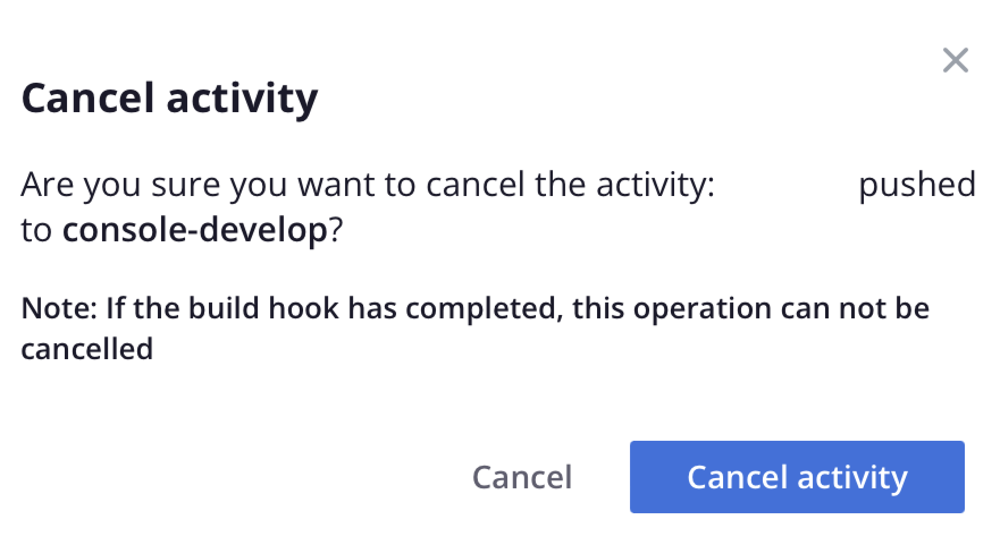

# Flusso di attività

La vista principale di ciascun ambiente mostra un **Attività** elenco di eventi storici simili a un registro Git. L’elenco Attività è un flusso degli eventi recenti per gli ambienti attivi. Di seguito è riportato un elenco dei tipi di attività e delle relative icone visualizzate nel flusso Attività:

{width="500" align="center"}

## Visualizzare i registri

Nell’elenco Attività fai clic sull’icona di stato di un’attività per visualizzare il registro. In alternativa, fare clic su {width="32"} (_altro_) per accedere a più opzioni per la gestione dell&#39;attività. Di seguito è riportato un breve registro che crea un backup. È possibile [utilizzare Cloud CLI](#activity-stream-with-cloud-cli) per visualizzare lo stesso registro.


## Gestire un’attività

Alcune attività si trovano in una _in esecuzione_ o _in sospeso_ stato. Puoi agire su un’attività in esecuzione, ad esempio annullando una distribuzione in esecuzione. Le schede seguenti mostrano due metodi per annullare un’attività: [!DNL Cloud Console] o Cloud CLI.

>[!BEGINTABS]

>[!TAB Console]

**Per annullare un&#39;attività in[!DNL Cloud Console]**:

Puoi agire su un’attività in esecuzione accedendo a {width="32"} (_altro_) e selezionando un&#39;azione, ad esempio `Cancel` o `View log`. Per questo esempio, seleziona la **Annulla** per interrompere l&#39;attività in esecuzione.

Non tutte le attività dispongono dell’opzione di annullamento. Ad esempio, l’opzione per annullare la distribuzione dell’applicazione viene visualizzata solo durante _build_ fase. Una volta che l’applicazione è stata spostata in _distribuire_ fase, non è più possibile annullare l’attività. Consulta [Processo di distribuzione](../deploy/process.md) sulle diverse fasi.

{width="450" align="center"}

Se un terminale esegue l’attività di distribuzione, annullare in [!DNL Cloud Console] comporta la cancellazione nel terminale:

{width="300"}

>[!TAB CLI]

**Per annullare un’attività in Cloud CLI**:

1. Identifica le attività in esecuzione e seleziona un ID attività.

   ```bash
   magento-cloud activity:list --state=in_progress
   ```

1. Annulla l’attività utilizzando l’ID attività:

   ```bash
   magento-cloud activity:cancel wvl5wm7s5vkhy
   ```

>[!ENDTABS]

## Flusso attività filtro

La possibilità di filtrare l’elenco delle attività è utile quando cerchi qualcosa di specifico, ad esempio un backup o un evento di unione.

**Per filtrare l’elenco delle attività in[!DNL Cloud Console]**:

1. Seleziona un ambiente e scegli l’attività **[!UICONTROL All]** per includere la cronologia completa degli eventi.

1. Clic {width="32"} e seleziona la **[!UICONTROL Filter by]** opzioni:

   

1. Scegli l&#39;attività **[!UICONTROL Recent]** visualizzare e reimpostare l&#39;elenco.

## Visualizza flusso con Cloud CLI

Il `magento-cloud` CLI offre la maggior parte delle stesse funzionalità del [!DNL Cloud Console]. Il `activity` Il comando può:

- `list` il flusso di attività per un ambiente
- `get` dettagli su un’attività specifica
- visualizzare `log` per un’attività specifica
- `cancel` un’attività

**Per visualizzare il flusso di attività con Cloud CLI**:

1. Elencare le attività per l’ambiente corrente.

   ```bash
   magento-cloud activity:list
   ```

1. Ogni attività ha un ID univoco. Seleziona un ID dall’elenco precedente e visualizza i dettagli di tale attività.

   ```bash
   magento-cloud activity:get wvl5wm7s5vkhy
   ```

1. Visualizza il registro completo dell’attività.

   ```bash
   magento-cloud activity:log wvl5wm7s5vkhy
   ```

   Risposta di esempio:

   ```bash
   Activity ID: wvl5wm7s5vkhy
   Type: environment.backup
   Description: User created a backup of Master
   Created: 2023-09-08T14:03:33+00:00
   State: complete
   Log:
   Creating backup of master
   Created backup eg5pu63egt2dcojkljalzjdopa
   ```
